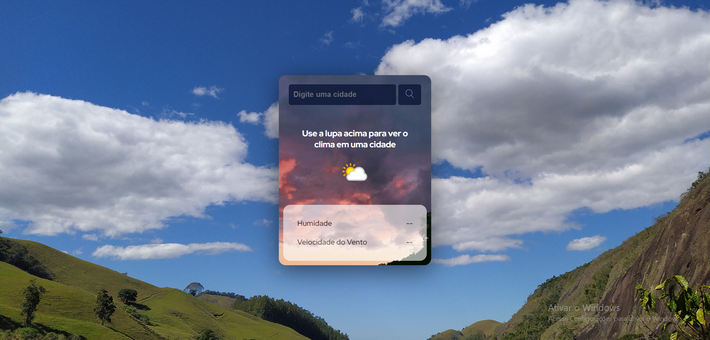
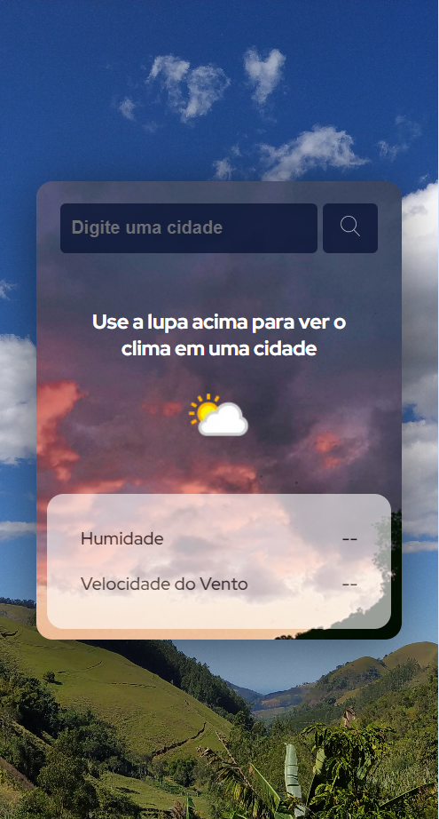
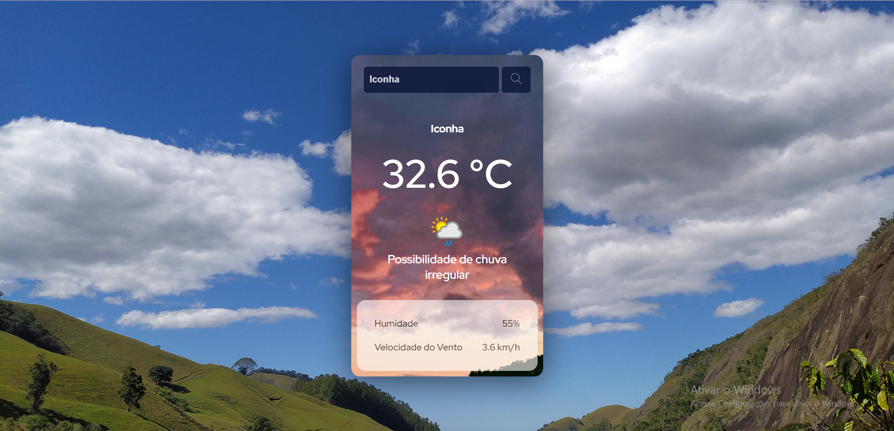

# Projeto - App Previsão do Tempo
Projeto realizado durante a Black em Dobro - Dev em Dobro

## Objetivos ao pesquisar o nome da cidade:
- Mostrar a temperatura da cidade
- O ícone da condição do tempo
- A condição do tempo em forma de texto
- A humidade em %
- E a velocidade do vento em km/h

## Dificuldades:
- Mudar o ícone da condição do tempo, pegando na API
- E não deixar da erro quando a pessoa pesquisa uma cidade que não existe na API

## Tecnologias

- HTML
- CSS
- JS

## Screenshots

### Desktop

### Mobile

### Status - Desktop

